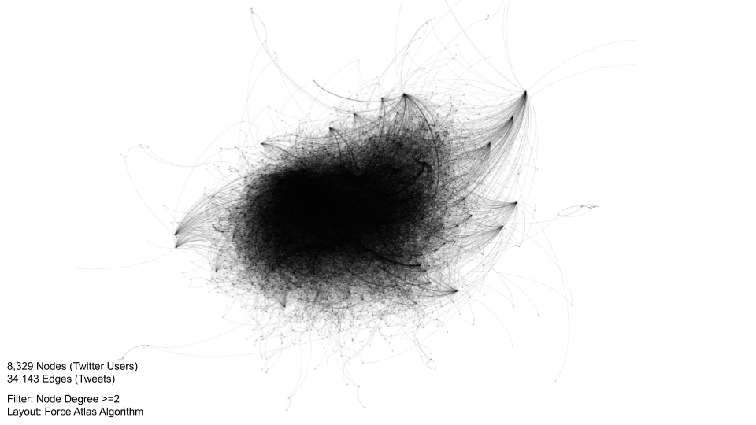
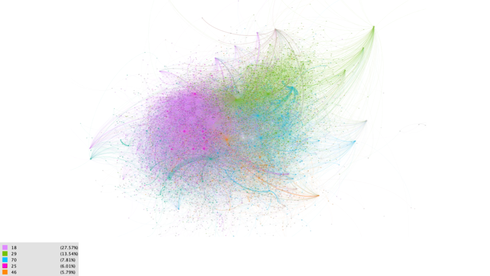
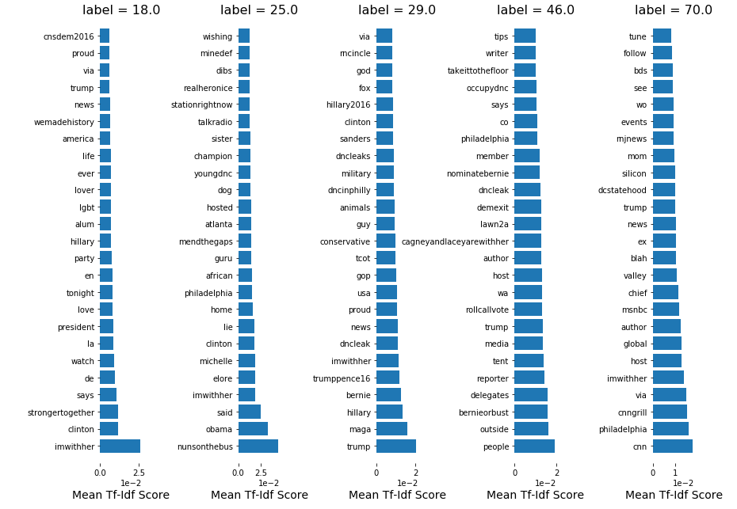
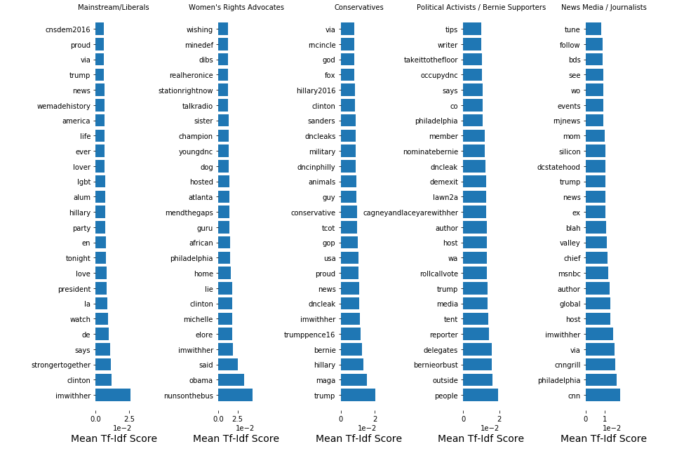
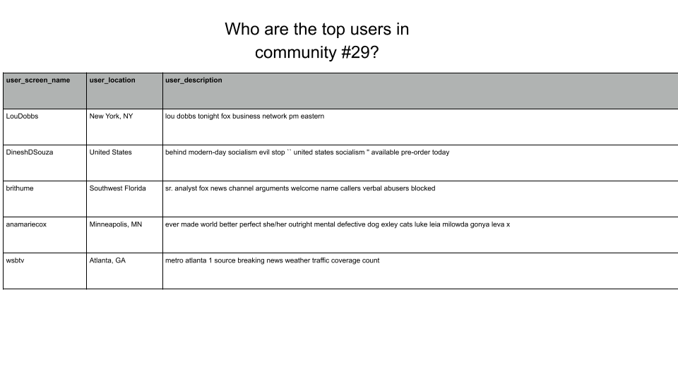

# Network Analysis of the 2016 Democratic  Convention
### *Identifying political communities on twitter using graph theory and natural language processing*


### Introduction to Network Analysis

- Graphs made with Gephi Software 
- Nodes = Users
- Edges =  Tweets
- Nodes are weighted by the sum of their edges

Data:
- 130,000 tweets about the 2016 DNC convention
- 8,329 Nodes
- 34,143 Edges 
- User metadata for each tweet


### Network Graph


### Partitioned Users



### Labeling Communities
- What words do members of the community use most frequently in conversation? 
- What words do members of the community use to describe themselves?
- Who are the top 5 most influential users in the community? 
- What terms/words are most significant in defining the community (TF-IDF)


### What words do members of the community most frequently use to describe themselves?
Example: Community 29


### What words do members of the community most frequently use in their tweets?
Example: Community 29


### Extract the most important keywords used by each community

With labels:


### Find the most influential users in each community
- Example: Top 5 users in community 29


### Predicting User Community: Accuracy 


For each user, combine their description with the text of all their tweets.
“Vectorize” the text data and fit models using the Scikit Learn module.


- Logistic Regression Model: 0.47
- Random Forest Model: 0.46
- Stochastic Gradient Descent Model: 0.48
- Naive Bayes Model: 0.45


### Limitations:

- Only 902 twitter users in final dataset
- Multiple classification with 5 classes 
- Gephi can only handle so much data at a time.

### Future Work:

- Perform sentiment analysis on each tweet (positive or negative)
- Reduce the number of classes
- Run the network analysis on a virtual machine with more memory and computational power.


```python

```
